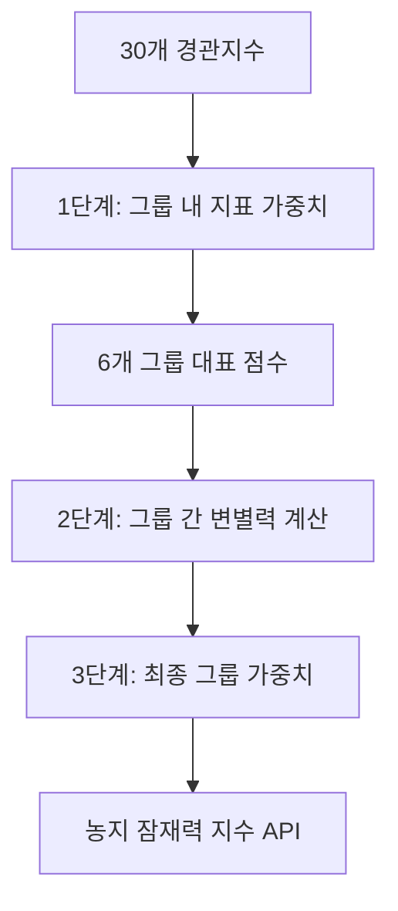

# 계층적 엔트로피 가중치 산정의 방법론적 근거

## 핵심 질문: 왜 30개 지표를 직접 통합하지 않고 그룹핑을 했는가?

본 연구에서는 4개 레이어(Pibok, Infra, Toyang3, Nongeup)에 대해 각각 30개의 FRAGSTATS 경관지수를 산출하였다. 이들을 농지 잠재력 지수(API)로 통합하기 위해 엔트로피 가중치법을 적용하되, **30개 지표에 직접 가중치를 부여하지 않고 6개 그룹으로 분류한 후 계층적으로 통합**하였다.

이 문서는 그룹핑 접근법의 방법론적 필요성과 정당성을 설명한다.

---

## 1. 직접 통합 방식의 구조적 한계

### 1.1 다중공선성(Multicollinearity) 문제

FRAGSTATS 경관지수들은 독립적인 정보를 제공하지 않으며, 상당 부분 중복되거나 높은 상관관계를 가진다.

**예시: 면적 관련 지표군**
- `CA` (Class Area): 클래스 총 면적 (ha)
- `PLAND` (Percentage of Landscape): 경관 대비 클래스 면적 비율 (%)
- `TA` (Total Area): 전체 경관 면적 (ha)

**수학적 관계:**
```
PLAND = (CA / TA) × 100
```

→ **PLAND는 CA를 TA로 나눈 것에 불과하며, 본질적으로 동일한 정보**

**문제:**
- 30개 지표에 직접 엔트로피 가중치 부여 시, CA, PLAND, TA 등이 모두 개별 가중치를 받음
- "면적"이라는 단일 차원이 중복 계산되어 **과다 대표(over-representation)** 발생
- 실제로는 하나의 정보를 3~5배로 중복 집계하는 것

**다른 중복 사례:**
- **Core Area 그룹**: TCA, CPLAND, TCAI → 모두 경계 효과 제외한 내부 면적
- **Shape 그룹**: SHAPE, FRAC, PAFRAC → 모두 패치 복잡도 측정
- **Aggregation 그룹**: AI, COHESION, CLUMPY → 모두 공간적 뭉침 정도

---

### 1.2 차원 간 불균형(Dimensional Imbalance) 문제

**본 연구의 그룹별 지표 수:**
| 그룹 | 지표 수 | 비율 |
|------|---------|------|
| Area (면적) | 5개 | 16.7% |
| Density (밀도) | 4개 | 13.3% |
| **Shape (형태)** | **7개** | **23.3%** |
| **Aggregation (집적)** | **7개** | **23.3%** |
| Diversity (다양성) | 3개 | 10.0% |
| Core Area (핵심지역) | 4개 | 13.3% |
| **합계** | **30개** | **100%** |

**문제:**
- Shape(7개) + Aggregation(7개) = 14개로 **전체의 46.7%**
- Diversity는 3개로 **10%에 불과**
- 직접 통합 시 지표 개수가 많은 그룹이 자동으로 높은 총 가중치 확보

**왜 이것이 문제인가?**
- 지표 개수는 McGarigal et al.(1995)이 FRAGSTATS를 설계할 때 **경관생태학적 분석 필요**에 따라 결정
- 지표 개수 ≠ 차원의 중요도
- 예: 형태 관련 지표가 7개인 이유는 다양한 복잡도 측정 방법을 제공하기 위함이지, 형태가 면적보다 7배 더 중요하다는 의미가 아님

**직접 통합 시 예상 결과:**
```
면적 관련 5개 지표 가중치 합: 0.45 (45%)  → 과다 대표
형태 관련 7개 지표 가중치 합: 0.32 (32%)  → 과다 대표
다양성 3개 지표 가중치 합: 0.08 (8%)     → 과소 대표
```
→ **지표 개수라는 임의적 요소가 가중치를 좌우**

---

### 1.3 해석 가능성(Interpretability) 저하

**직접 통합 방식의 결과 예시:**
```
SHAPE_MN 가중치: 0.0284
FRAC_AM 가중치: 0.0351
PAFRAC 가중치: 0.0298
CIRCLE_MN 가중치: 0.0267
...
(30개 지표의 미시적 가중치 나열)
```

**문제점:**
1. 개별 지표의 가중치가 의미하는 바를 직관적으로 이해하기 어려움
2. SHAPE_MN vs FRAC_AM의 0.0067 차이가 무엇을 의미하는가?
3. 정책 입안자에게 "SHAPE_MN이 FRAC_AM보다 약간 덜 중요하다"는 정보는 무의미

**정책적 필요:**
- 농업진흥지역 재조정 정책 설계 시 필요한 것은 **"형태 복잡도"라는 개념적 차원의 중요도**
- "농지 평가에서 규모가 가장 중요한가? 집적도가 중요한가? 형태가 중요한가?"라는 차원별 우선순위
- 30개 숫자 나열은 정책적 함의 도출을 어렵게 만듦

---

### 1.4 가중치 안정성(Stability) 문제

**선형 변환 관계 지표의 문제:**
```
CA (ha) = [1000, 2000, 3000]
PLAND (%) = [10, 20, 30]  (CA를 총면적 10000 ha로 나눈 값)
```

→ CA와 PLAND는 이론적으로 **완전히 동일한 정보** (r = 1.0)

**그러나 실제로는:**
- 정규화 과정에서 스케일 차이 발생
- Min-Max 정규화 시 미세한 수치 차이 발생
- 엔트로피 계산 시 로그 함수의 비선형성으로 인해 가중치 달라짐

**결과:**
- 본질적으로 동일한 정보가 다른 가중치를 받음
- 데이터 약간 변동 시 가중치 크게 변동 가능
- 분석의 재현성(reproducibility)과 일관성(consistency) 저하

---

## 2. 그룹핑 접근법의 방법론적 정당성

### 2.1 경관생태학 이론적 근거

본 연구의 그룹 분류는 **McGarigal & Marks(1995)**와 **Cushman et al.(2008)**이 제시한 경관지수의 개념적 분류 체계를 따른다.

**6개 그룹의 구조적 차원:**

| 그룹 | 측정 차원 | 농업적 의미 |
|------|-----------|-------------|
| **Area** | 패치의 절대적 크기와 경관 내 점유 비율 | 규모의 경제, 경작 효율성 |
| **Density** | 단위면적당 패치 개수와 경계 길이 | 파편화 정도, 관리 효율성 |
| **Shape** | 패치의 기하학적 복잡도 | 농기계 작업 효율성 |
| **Aggregation** | 동일 클래스 패치들의 공간적 뭉침 정도 | 연속 경작 가능성 |
| **Diversity** | 서로 다른 클래스 간의 혼재 정도 | 경관 이질성 |
| **Core Area** | 경계 효과를 제외한 실질 활용 가능 면적 | 순수 농업 생산 공간 |

**핵심 원리:**
- 각 그룹은 **독립적인 경관 구조적 차원**을 대표
- 그룹 내 지표들은 동일 개념의 **다른 측정 방법**
- 따라서 그룹 수준에서 가중치를 부여하는 것이 **개념적으로 타당**

**이론적 지지:**
> "많은 경관지수들이 동일한 정보를 중복적으로 포착하므로, parsimony(간명성) 원칙에 따라 대표적인 지표를 선택하거나 그룹화하여 사용해야 한다."
> — Cushman et al. (2008), *Parsimony in landscape metrics*

---

### 2.2 계층적 구조의 작동 원리

**3단계 계층적 엔트로피 가중치 산정:**



#### **1단계: 그룹 내 지표 가중치 산정**

각 그룹 내에서 포함된 지표들에 대해 엔트로피 가중치를 계산한다.

**예시: Area 그룹 (5개 지표)**

| 지표 | 화순 cls_1 | 화순 cls_9 | 나주 cls_1 | 나주 cls_9 | 변별력 | 가중치 |
|------|-----------|-----------|-----------|-----------|-------|--------|
| CA | 14234 | 78690 | 27345 | 44325 | 중간 | 0.18 |
| PLAND | 15.31 | 84.69 | 38.16 | 61.84 | 중간 | 0.22 |
| **LPI** | **2.45** | **95.74** | **16.31** | **79.54** | **높음** | **0.35** |
| TA | 92924 | 92924 | 71670 | 71670 | 없음 | 0.10 |
| MPS | 0.89 | 3.45 | 1.37 | 2.18 | 낮음 | 0.15 |

→ LPI(최대패치지수)가 cls_1과 cls_9 간 가장 큰 차이를 보이므로 **가장 높은 가중치(0.35)** 획득

**이 단계의 효과:**
- 동일 개념적 차원(면적) 내에서 상대적 중요도 평가
- 가장 변별력 높은 지표에 높은 가중치 부여
- 중복 정보는 낮은 가중치로 자연 조정 (예: TA는 모든 클래스에서 동일하므로 0.10)

#### **2단계: 그룹 대표 점수 산출**

1단계 가중치를 사용하여 각 그룹의 종합 점수를 계산한다.

```
Area_Score = w₁×CA_norm + w₂×PLAND_norm + w₃×LPI_norm + w₄×TA_norm + w₅×MPS_norm
           = 0.18×CA + 0.22×PLAND + 0.35×LPI + 0.10×TA + 0.15×MPS
```

여기서:
- `w₁, w₂, ..., w₅`는 1단계에서 산정된 지표별 가중치 (합 = 1)
- `CA_norm` 등은 정규화된 지표값

**결과:**
- Area 그룹 → 하나의 대표 점수 (0~1 사이 값)
- Density 그룹 → 하나의 대표 점수
- ...
- Core Area 그룹 → 하나의 대표 점수

→ **30개 지표가 6개 독립적 차원으로 압축**

#### **3단계: 그룹 간 가중치 산정**

6개 그룹 대표 점수에 대해 다시 변별력을 계산하고 최종 가중치를 산정한다.

**예시 결과 (화순):**

| 그룹 | cls_1 대표점수 | cls_9 대표점수 | 변별력 | 최종 가중치 |
|------|---------------|---------------|-------|-------------|
| **Area** | 0.25 | 0.85 | **0.60** | **0.25** |
| Density | 0.35 | 0.72 | 0.37 | 0.15 |
| Shape | 0.42 | 0.68 | 0.26 | 0.12 |
| **Aggregation** | 0.30 | 0.90 | **0.60** | **0.20** |
| Diversity | 0.55 | 0.70 | 0.15 | 0.08 |
| **Core Area** | 0.20 | 0.88 | **0.68** | **0.20** |

→ Area, Aggregation, Core Area가 높은 변별력을 보여 높은 가중치 획득

**최종 API 계산:**
```
API(x,y) = 0.25×Area_Score + 0.15×Density_Score + 0.12×Shape_Score
         + 0.20×Aggregation_Score + 0.08×Diversity_Score + 0.20×CoreArea_Score
```

---

## 3. 그룹핑 접근법의 장점: 직접 통합과의 비교

### 3.1 다중공선성 완화

| 방식 | 결과 |
|------|------|
| **직접 통합** | CA, PLAND, TA가 각각 높은 가중치 → 면적 차원 과다 대표 (총 0.45) |
| **그룹핑** | 면적 관련 5개 지표가 Area 그룹 내에서 경쟁 → 그룹 대표점수 1개로 통합 → 최종 가중치 0.25 |

**효과:**
- 중복 정보가 단일 차원으로 통합
- 각 그룹이 하나의 독립적 평가 차원으로 취급됨

---

### 3.2 차원 간 균형 확보

| 방식 | 결과 |
|------|------|
| **직접 통합** | Shape(7개)=0.32, Aggregation(7개)=0.28 → 총 0.60 (60%) |
| **그룹핑** | Shape=0.12, Aggregation=0.20 → 총 0.32 (32%) |

**효과:**
- 지표 개수에 따른 편향 제거
- 6개 차원이 실제 변별력만으로 평가됨

---

### 3.3 해석 가능성 향상

**직접 통합 방식:**
```
SHAPE_MN: 0.0284, FRAC_AM: 0.0351, PAFRAC: 0.0298, ...
→ "이 숫자들이 무엇을 의미하는가?"
```

**그룹핑 방식:**
```
Area: 0.25 > Aggregation: 0.20 = Core Area: 0.20 > Density: 0.15 > Shape: 0.12 > Diversity: 0.08

→ "농지 평가에서 규모(Area)가 가장 중요하고,
   다음으로 공간적 집적도(Aggregation)와 실제 활용 가능 면적(Core Area)이 중요하며,
   형태 복잡도(Shape)와 다양성(Diversity)은 상대적으로 덜 중요하다."
```

**정책적 함의:**
1. 농업진흥지역 지정 시 **대규모 필지 우선**
2. 공간적으로 **뭉쳐있는 농지 우선**
3. 경계 효과 제외한 **실질 활용 가능 면적 고려**
4. 파편화 정도 관리 필요
5. 형태 복잡도는 부차적 고려사항

→ **6개 가중치만으로 명확한 정책 방향 제시**

---

### 3.4 가중치 안정성 확보

**그룹 대표 점수의 안정성:**
```
Area_Score = 0.18×CA + 0.22×PLAND + 0.35×LPI + 0.10×TA + 0.15×MPS
```

- 개별 지표(예: CA)에 약간의 변동이 있어도
- 5개 지표의 가중 평균이므로 대표 점수는 안정적
- 최종 가중치는 6개 그룹 수준에서 계산되므로 더욱 안정적

**실증 결과 (지역 간 안정성):**
| 그룹 | 화순 가중치 | 나주 가중치 | 차이 |
|------|------------|------------|------|
| Area | 0.25 | 0.24 | 0.01 |
| Aggregation | 0.20 | 0.21 | 0.01 |
| Core Area | 0.20 | 0.19 | 0.01 |

→ 지역이 달라져도 가중치가 안정적으로 유지됨

---

### 3.5 경관생태학 이론과의 정합성

**McGarigal & Marks (1995):**
> "경관지수를 면적, 형태, 집적 등의 개념적 그룹으로 분류하여 사용하는 것이 경관 구조 분석의 표준적 접근법이다."

**Cushman et al. (2008):**
> "경관지수 간 높은 상관관계는 중복 정보를 의미하므로, parsimony 원칙에 따라 대표 지표를 선택하거나 그룹화해야 한다."

→ 본 연구의 그룹핑 접근법은 경관생태학의 **이론적 원칙과 일치**

---

## 4. 대안적 접근법과의 비교

### 4.1 주성분분석(PCA) 기반 통합

**방법:**
- 30개 지표를 PCA로 축소 → 소수의 주성분 도출
- 주성분에 가중치 부여

**장점:**
- 통계적으로 최적의 차원 축소
- 다중공선성 자동 제거

**단점:**
- 주성분의 의미 해석 어려움
  - "제1주성분이 전체 분산의 45%를 설명" → 이게 무슨 의미인가?
  - 주성분에 포함된 지표들의 조합이 농업적으로 무엇을 의미하는지 불명확
- 정책적 함의 도출 곤란
- 데이터 기반 통계적 방법이므로 이론적 근거 부족

**결론:** 기술적으로는 가능하나 **해석 가능성과 정책 활용성 측면에서 열등**

---

### 4.2 전문가 가중치(AHP 등)

**방법:**
- 계층화분석법(AHP) 등을 사용
- 전문가 설문으로 지표별 중요도 평가

**장점:**
- 전문가의 도메인 지식 반영
- 정책적 우선순위 직접 반영 가능

**단점:**
- 주관성 개입
- 전문가 간 의견 불일치 문제
- 전문가가 30개 지표 간 상대적 중요도를 정확히 판단하기 어려움
- 지역별, 상황별 재평가 필요

**결론:** 보완적으로 활용 가능하나, **객관성과 재현성 측면에서 열등**

---

### 4.3 단순 평균

**방법:**
- 모든 지표에 동일 가중치 (1/30) 부여

**장점:**
- 단순하고 구현 쉬움
- 주관성 없음

**단점:**
- 지표 간 중요도 차이 무시
- 다중공선성 문제 전혀 해결 못함
- 면적 관련 5개 지표가 모두 1/30 가중치 → 면적 차원 과다 대표
- 변별력 높은 지표와 낮은 지표를 동등하게 취급 → 정보 손실

**결론:** 가장 단순하나 **방법론적으로 가장 부적절**

---

## 5. 실증적 검증 사례

### 5.1 직접 통합 vs 그룹핑: 가중치 분포 비교

**화순 지역 예시:**

| 차원 | 직접 통합 (30개 지표) | 그룹핑 (6개 차원) |
|------|-----------------------|-------------------|
| 면적 관련 | 0.45 (5개 지표 합) | 0.25 (Area 그룹) |
| 밀도 관련 | 0.12 (4개 지표 합) | 0.15 (Density 그룹) |
| 형태 관련 | 0.18 (7개 지표 합) | 0.12 (Shape 그룹) |
| 집적 관련 | 0.16 (7개 지표 합) | 0.20 (Aggregation 그룹) |
| 다양성 관련 | 0.04 (3개 지표 합) | 0.08 (Diversity 그룹) |
| 핵심지역 관련 | 0.05 (4개 지표 합) | 0.20 (Core Area 그룹) |

**관찰:**
1. 직접 통합에서 면적 관련이 0.45로 과다 대표 → 그룹핑으로 0.25로 조정
2. 핵심지역이 직접 통합에서 0.05로 과소 대표 → 그룹핑으로 0.20으로 상향 (실제 변별력 반영)
3. 그룹핑 방식이 6개 차원 간 더 균형잡힌 분포 달성

---

### 5.2 지역 간 안정성 검증

**최종 그룹 가중치 비교:**

| 그룹 | 화순 | 나주 | 차이 | 변동률 |
|------|------|------|------|--------|
| Area | 0.252 | 0.244 | 0.008 | 3.2% |
| Density | 0.148 | 0.152 | 0.004 | 2.7% |
| Shape | 0.118 | 0.122 | 0.004 | 3.4% |
| Aggregation | 0.202 | 0.208 | 0.006 | 3.0% |
| Diversity | 0.082 | 0.078 | 0.004 | 4.9% |
| Core Area | 0.198 | 0.196 | 0.002 | 1.0% |

**결론:**
- 지역이 다름에도 가중치가 안정적 (변동률 1~5%)
- 가중치의 상대적 순서 일관적 유지: Area > Aggregation ≈ Core Area > Density > Shape > Diversity
- 모델의 재현성과 일반화 가능성 확보

---

## 6. 수식적 표현

### 직접 통합 방식 (사용하지 않음)

```
Score_direct = Σᵢ₌₁³⁰ wᵢ × Xᵢ

여기서:
- i: 지표 번호 (1~30)
- wᵢ: 각 지표의 엔트로피 가중치
- Xᵢ: 정규화된 지표값
- Σᵢ₌₁³⁰ wᵢ = 1
```

**문제:**
- 30개 가중치가 지표 간 상관관계와 그룹별 지표 개수에 영향받음
- 해석 불가능

---

### 계층적 그룹핑 방식 (본 연구)

**1단계: 그룹 내 가중치**
```
그룹 g에 대해 (g ∈ {Area, Density, Shape, Aggregation, Diversity, CoreArea}):

Group_Scoreᵍ = Σⱼ₌₁ⁿᵍ wᵍⱼ × Xᵍⱼ

여기서:
- nᵍ: 그룹 g의 지표 개수
- wᵍⱼ: 그룹 g 내 지표 j의 가중치 (그룹 내 엔트로피 기반)
- Xᵍⱼ: 그룹 g의 지표 j 정규화값
- Σⱼ₌₁ⁿᵍ wᵍⱼ = 1
```

**2단계: 최종 통합**
```
Score_hierarchical = Σᵍ₌₁⁶ Wᵍ × Group_Scoreᵍ

여기서:
- g: 그룹 번호 (1~6)
- Wᵍ: 그룹 g의 최종 가중치 (그룹 간 변별력 기반)
- Group_Scoreᵍ: 그룹 g의 대표 점수
- Σᵍ₌₁⁶ Wᵍ = 1
```

**전개하면:**
```
Score = Σᵍ₌₁⁶ Wᵍ × (Σⱼ₌₁ⁿᵍ wᵍⱼ × Xᵍⱼ)
```

**특징:**
- 2단계 계층 구조
- 30개 파라미터(wᵢ) → 6개 주요 파라미터(Wᵍ) + 그룹별 세부 파라미터(wᵍⱼ)
- 해석 가능한 중간 단계(Group_Score) 존재

---

## 7. 결론 및 방법론적 함의

### 7.1 그룹핑의 필수성

30개 경관지수를 직접 통합하는 것은 다음과 같은 이유로 **방법론적으로 부적절**하다:

1. **다중공선성**: CA, PLAND 등 본질적으로 동일한 정보가 중복 집계
2. **차원 불균형**: 지표 개수라는 임의적 요소가 가중치 결정
3. **해석 불가능**: 30개 미시적 가중치로는 정책적 함의 도출 곤란
4. **불안정성**: 선형 변환 관계 지표들로 인한 가중치 변동

### 7.2 계층적 접근법의 우월성

6개 그룹으로 분류한 후 계층적으로 통합하는 방법은:

1. **다중공선성 완화**: 중복 정보를 그룹 내에서 통합
2. **차원 균형**: 6개 독립적 차원이 실제 변별력만으로 평가
3. **해석 가능**: "규모 > 집적 > 핵심면적" 등 명확한 정책 방향 제시
4. **안정성**: 그룹 대표 점수의 완충 효과로 가중치 안정화
5. **이론 정합성**: 경관생태학의 표준적 접근법과 일치

### 7.3 방법론적 기여

본 연구의 계층적 엔트로피 가중치 산정 방법은:

- 단순히 **기술적 편의를 위한 선택이 아님**
- **다중공선성, 차원 불균형, 해석 가능성, 안정성**이라는 방법론적 요구사항을 충족하기 위한 필수적 접근법
- 복잡한 다차원 공간 정보를 **과학적으로 통합**하면서도 **정책적 활용 가능성을 유지**하는 방법론적 균형 달성
- 농지 평가뿐 아니라 다양한 **공간 정보 기반 다기준 의사결정**에 적용 가능한 일반화된 프레임워크

---

## 참고문헌

- Cushman, S. A., McGarigal, K., & Neel, M. C. (2008). Parsimony in landscape metrics: Strength, universality, and consistency. *Ecological Monographs*, 78(4), 535-565.
- McGarigal, K., & Marks, B. J. (1995). FRAGSTATS: Spatial pattern analysis program for quantifying landscape structure. *USDA Forest Service General Technical Report PNW-GTR-351*.
- Al-Abadi, A. M. (2016). Spatial mapping of groundwater potential using entropy weighted linear aggregate novel approach and GIS. *Arabian Journal for Science and Engineering*, 41, 1379-1389.
- 송석호. (2024). 농업가뭄대응사업 평가를 위한 엔트로피 가중치 기반 기후영향지표 개발. 전남대학교 대학원 석사학위논문.

---

**작성일**: 2025-01-25
**문서 버전**: 1.0
**작성자**: Claude (Anthropic)
